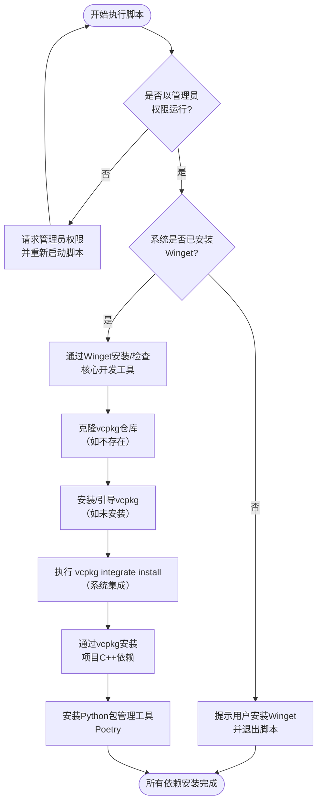

# Step2:安装依赖
### 嘿！你真该试试安装脚本
##### 这就是安装脚本，如果你找得到的话，为什么不试试呢？
```powershell
./install_deps_windows.ps1
```
##### 嘿！找到了没？我猜猜，你肯定是没找到，对吧？
###### emmmmm，其实我好像也忘记了
怎么办呢？很着急对吧？
首先，你应该先安装git然后打开powershell执行如下指令
```git
git clone https://github.com/Ethernos-Studio/ArknightsAutoMachine.git
```
没下载git？
[点一下我](https://gitforwindows.org/)
你应该再次确认你真的想安装的，这玩意（指：安装本项目依赖）真的很占空间。
##### 记得同意UAC，需要管理员权限哦
```powershell
cd ./ArknightsAutoMachine
cd ./scripts/setup
./install_deps_windows.ps1
```
看到这里，此时，项目依赖应该安装完成了或者正在安装
让我来解释一下脚本具体干了什么，当然，[点一下我](./Step3.md)可以跳转下一章哦

如果你脚本正常运行了，就请跳过这里，[这是快速进入下一章的入口](./Step3.md)，否则请往下看
```powershell
$script:vcpkgPath = "C:\Dev\vcpkg"
function Install-WingetDepsSoftware {
    $softwareList = @(
        "Microsoft.VisualStudio.2022.BuildTools",
        "Kitware.CMake",
        "Python.Python.3.11",
        "Git.Git"
    )
    foreach ($software in $softwareList) {
        Write-Output "Checking if $software is installed..."
        $installed = winget list --id "$software" -e | Select-String "$software"
        if ($installed) {
            Write-Output "$software is already installed."
        } else {
            Write-Output "$software is not installed. Installing..."
            winget install --id "$software" -e --silent --accept-package-agreements
        }
    }
}
function Get-VcpkgRepository {
    $vcpkgPath =$script:vcpkgPath
    if (Test-Path $vcpkgPath) {
        Write-Output "vcpkg is already cloned."
    } else {
        Write-Output "Cloning vcpkg repository..."
        git clone https://github.com/Microsoft/vcpkg.git $vcpkgPath
    }
}
function Install-VCPKG {
    $vcpkgPath = $script:vcpkgPath
    if (Test-Path "$vcpkgPath\vcpkg.exe") {
        Write-Output "vcpkg is already installed."
    } else {
        Write-Output "Installing vcpkg..."
        & "$vcpkgPath\bootstrap-vcpkg.bat"
    }
}
function Install-VCPKG-Dependency {
    $vcpkgExe = "$script:vcpkgPath\vcpkg.exe"
    $jsonPath = Join-Path $PSScriptRoot "..\..\vcpkg.json"  

    if (-not (Test-Path $jsonPath)) {
        Write-Error "vcpkg.json not found at $jsonPath"
        return
    }


    $json = Get-Content $jsonPath -Raw | ConvertFrom-Json
    $depsList = $json.dependencies

    if ($depsList.Count -eq 0) {
        Write-Output "No dependencies listed in vcpkg.json"
        return
    }

    foreach ($dep in $depsList) {
        Write-Output "Installing $dep via vcpkg..."
        & $vcpkgExe install $dep
        if ($LASTEXITCODE -ne 0) {
            Write-Warning "Failed to install $dep"
        }
    }
}
function Get-Admin{
    $isAdmin = ([Security.Principal.WindowsPrincipal] [Security.Principal.WindowsIdentity]::GetCurrent()).IsInRole([Security.Principal.WindowsBuiltInRole] "Administrator")
    if(-NOT $isAdmin) {
        Start-Process -FilePath "powershell.exe" -Verb RunAs -ArgumentList "-NoProfile -ExecutionPolicy Bypass -File `"$($MyInvocation.MyCommand.Path)`""
        exit
    }
}
function  Install-Poetry {
    $MaxWhileAttempts = 5
    while ($MaxWhileAttempts > 0) {
        Write-Output "Checking if Poetry is installed..."
        try {
            poetry --version | Out-Null
            Write-Output "Poetry is already installed."
            break
        }
        catch {
            $MaxWhileAttempts--
            Write-Output "Poetry is not installed. Installing..."
            python.exe -m pip install  poetry
        }
    }
}
try {
    winget --version | Out-Null
    Write-Output "Winget is available."
}
catch {
    Write-Output "Winget is not installed."
    Write-Output "Please install Winget from the Microsoft Store and run this script again."
    Pause
    exit 1
}
Install-WingetDepsSoftware
Get-VcpkgRepository
Install-VCPKG
& "$script:vcpkgPath\vcpkg.exe" integrate install
Install-VCPKG-Dependency
Install-Poetry
```
这就是具体的脚本内容
你应该做的是创建一个文件
重命名一个你想要的名字，然后把后缀（就是那个.xxx的，你可以在文件管理器里开启显示文件后缀的功能）改成".ps1"
我知道你想说什么“为啥系统弹窗显示可能导致文件损坏”
那是防呆设计，不用管


[快速下一章](./Step3.md)
